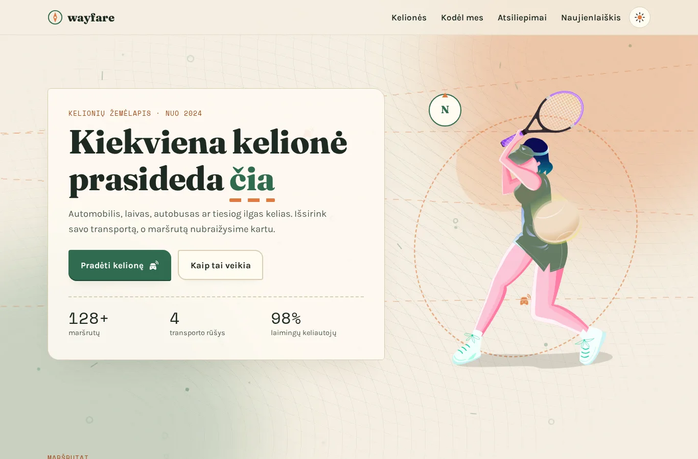
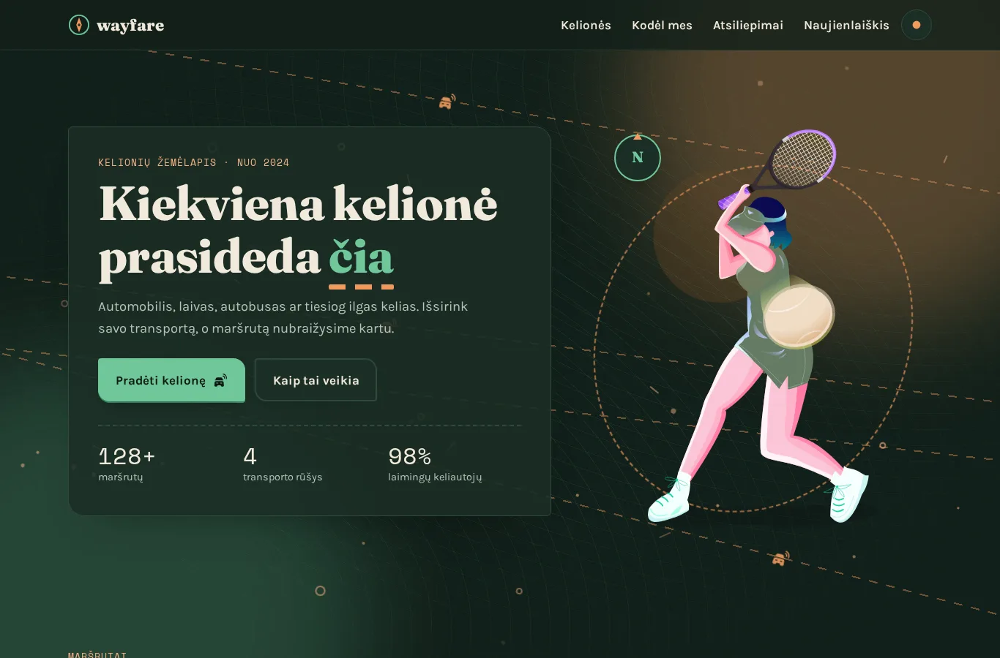
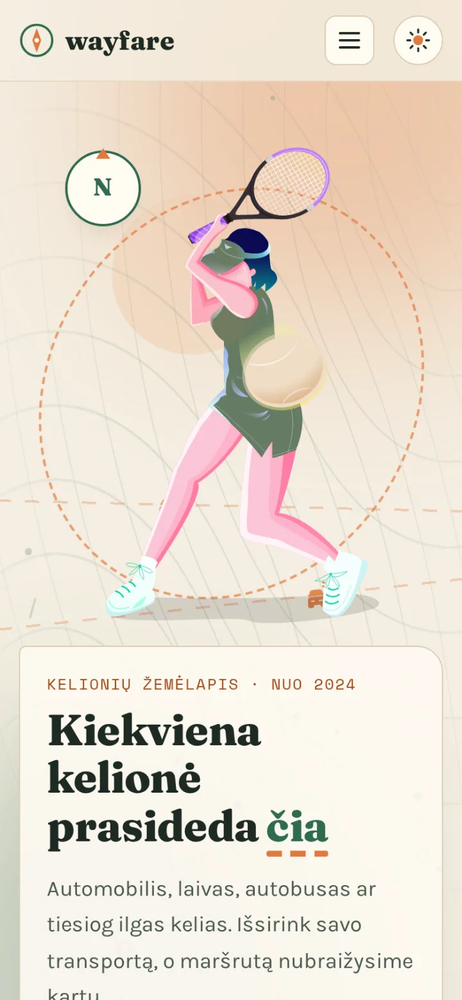

# Wayfare — kelionių žemėlapis

Vieno puslapio kelionių svetainė su gyvu žemėlapio fonu: automobiliu, laivu, autobusu ar tiesiog keliu.

**[Gyva versija](https://brutall100.github.io/wayfare-travel-landing/)** · **[Kodas](https://github.com/brutall100/wayfare-travel-landing)**



<p>
  
  
</p>

## Apie projektą

Iš pradžių tai buvo „Awesome UI“ maketo perkėlimas į kodą: CSS pratimas su gradientais, perėjimais ir prisitaikančiu išdėstymu. Vėliau projektą perdariau į išbaigtą kelionių svetainę **Wayfare** su savo stiliumi: „popierinis žemėlapis“ dieną ir „naktinis žemėlapis“ tamsiame režime.

Wayfare yra išgalvotas prekės ženklas. Visi atsiliepimai ir vardai taip pat išgalvoti.

## Funkcijos

- **Gyvas žemėlapio fonas.** Lėtai plaukioja saulės ir miško švytėjimai, matosi žemėlapio aukščio linijos, punktyriniai maršrutai, kuriais važiuoja transportas, ir kylantys žemėlapio žymekliai. Dalelės sukuriamos atsitiktinai JavaScript'u.
- **Kelionių filtras.** Pasirenki transportą (automobilis, laivas, autobusas, kelias), ir lieka tik tos kelionės. Fone esantys maršrutai užsidega, o jais pradeda važiuoti pasirinktas transportas.
- **Bilieto formos kortelės** su išpjovomis šonuose ir perforacijos linija.
- **Mygtukai** pakyla užvedus pelę, nusileidžia paspaudus ir turi bangelę (ripple). Automobiliukas mygtuke „nuvažiuoja“, o lėktuvėlis naujienlaiškio mygtuke „išskrenda“.
- **Skaičiai suskaičiuoja** nuo 0, o sekcijos atsiranda slenkant.
- **Atsiliepimų slankiklis** su rodyklėmis, pirštu arba klaviatūra.
- **Naujienlaiškio forma** su el. pašto patikrinimu ir aiškiomis klaidų žinutėmis. Tai demo, todėl duomenys niekur nesiunčiami.
- **Šviesus ir tamsus režimai**: pagal sistemos nustatymą arba perjungimo mygtuku. Pasirinkimas įsimenamas, o puslapis kraunantis nesumirga.
- **Prieinamumas**: nuoroda „Pereiti prie turinio“, matomas `:focus-visible`, `alt` tekstai, `<label>` laukeliams, `aria-live` pranešimai. Jei sistemoje įjungtas `prefers-reduced-motion`, judesys išsijungia.
- **Veikia telefone** (390 px) be slinkimo į šoną. Telefone fone yra perpus mažiau dalelių.

## Technologijos

- **HTML, CSS ir JavaScript** be jokių bibliotekų ir be build žingsnio.
- CSS kintamieji, `color-mix()`, `mask` (ikonos ir bilieto išpjovos), `IntersectionObserver`.
- Animuojami tik `transform` ir `opacity`, fonas yra `position: fixed` ir `pointer-events: none`.

### Spalvų paletė

Visos spalvos yra `css/style.css` faile, `:root` bloke viršuje.

| Paskirtis | Šviesus | Tamsus |
|---|---|---|
| Fonas | `#F4EEE1` | `#12201A` |
| Paviršius (kortelės) | `#FFFBF2` | `#1B2E25` |
| Tekstas | `#1E2A24` | `#F1EADB` |
| Pagrindinis akcentas (miško žalia) | `#2F6B4F` | `#6FC79A` |
| Antras akcentas (saulėlydžio oranžinė) | `#E07A3F` | `#F29A5E` |
| Oranžinė tekstui | `#A34A1B` | `#F6B083` |

Kontrastas patikrintas pagal WCAG: visi tekstai turi bent 4.5:1. Šviesi oranžinė `#E07A3F` naudojama tik dekoracijoms (maršrutams, švytėjimui), o tekstui naudojama tamsesnė `#A34A1B` (5.1:1).

### Šriftai

- **Fraunces** antraštėms
- **Karla** tekstui
- **Space Mono** maršrutams ir skaičiams

Visi trys yra iš [Google Fonts](https://fonts.google.com/).

## Ko išmokau

- Kaip visą paletę laikyti CSS kintamuosiuose ir tamsų režimą padaryti keičiant tik juos.
- Kaip išvengti temos „sumirgėjimo“: mažas skriptas `<head>` dalyje nustato temą dar prieš piešiant puslapį.
- Kaip padaryti nesudėtingą, bet gyvą foną, kuris neapkrauna procesoriaus: animuoti tik `transform` ir `opacity`, o telefone rodyti mažiau dalelių.
- Kaip su `mask` padaryti bilieto išpjovas ir vienspalves ikonas, kurias galima nuspalvinti bet kokia spalva, vietoj dviejų to paties paveikslėlio versijų.
- Kaip filtrą, fono animaciją ir `aria-live` pranešimus sujungti į vieną sklandžią sąveiką.

## Paleisti savo kompiuteryje

Serverio ir `.env` failo nereikia. Užtenka:

```bash
git clone https://github.com/brutall100/wayfare-travel-landing.git
cd wayfare-travel-landing
python3 -m http.server 8000
```

Tada naršyklėje atidaryk <http://localhost:8000>.

> Geriau naudoti vietinį serverį, o ne tiesiog dukart spustelėti `index.html`. Kai failas atidaromas tiesiai (`file://`), naršyklės neleidžia užkrauti ikonų kaukių (`mask`).

## Projekto struktūra

```
index.html          visas puslapis
css/style.css       paletė, išdėstymas, animacijos
js/main.js          tema, meniu, gyvas fonas, filtras, slankiklis, forma
images/             iliustracija, nuotraukos (WebP), favicon, avatarai
images/icons/       transporto ikonos (naudojamos kaip CSS mask)
docs/               ekrano nuotraukos README failui
```

## Padėkos

- Pradinis maketas: „Awesome UI“ (Figma dizaino pratimas). Iš jo liko herojaus iliustracija ir transporto ikonos.
- Atsiliepimų nuotraukos: **Leon Ell'** ir **Philip Martin**, [Unsplash](https://unsplash.com/) (Unsplash licencija).
- Komandos nuotrauka paimta iš pradinio maketo, jos autorius nežinomas.
- Šriftai: Google Fonts (SIL Open Font License).

## Licencija

[MIT](LICENSE) © 2026 brutall100
